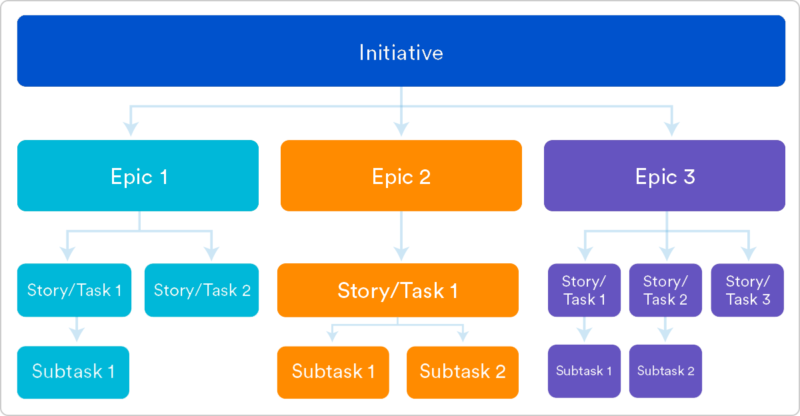

# User Stories

User Stories通常表达为“persona + need + purpose”的开发任务。

人们很容易简单地认为user stories就是需求。 但它们不是。

敏捷软件开发的一个关键组成部分是以人为本，User Stories将实际的最终用户置于对话的中心。 Stories 使用非技术语言为开发团队和工作内容提供上下文。 在阅读一个user story后，团队知道他们要构建的内容是什么, 为什么要构建, 以及构建的内容所创造的价值。

User story是敏捷工程的核心组件之一。 它们有助于为日常工作提供以用户为中心的框架 - 从而推动协作，创造力和实现整体上更好的产品。

## 敏捷的User Stories是什么?

User story是敏捷框架中最小的工作单元。 从软件用户的角度来看，User story是一个最终目标，而不是一个功能特性。

User story的目的是阐明一件作品如何将特定价值回馈给客户。 请注意，“客户”不必是传统意义上的外部终端用户，也可以是组织内部依赖团队的内部客户或同事。

User stories是用简单语言描述所需结果的几个句子。 不会详细说明细节。 一旦得到团队的同意，需求将在稍后添加。

Stories非常适合敏捷框架，如scrum和kanban。 在scrum中，user stories被添加到sprint中并在sprint持续时间内“burned down”。 kanban团队将User story引入其backlog并在其工作流程中运行。 这样的工作有助于Scrum团队在估算和sprint计划方面做得更好，从而实现更准确的预测和更高的灵活性。 由于stories，kanban团队可以学习如何管理WIP的工作，并可以进一步完善他们的工作流程。

User stories也是大型敏捷框架（如epics, initiatives）的基石。 Epics是大型工作项目，可分为一系列story，多个Epics包含一项initiative。 这些较大的结构确保开发团队通过日常工作实现构建到到epics和initiatives中的组织目标。

## 为什么要创建User Stories?

对于刚接触敏捷的开发团队来说，User story有时似乎是一个额外的步骤。 为什么不把大项目（epics）直接分成一系列步骤并继续下去呢？ 因为stories为团队提供了重要的背景和关联任务以及这些任务带来的价值。

User Stories提供了一些关键的好处：

- Stories将重点放在用户身上: To Do list使团队专注于需要检查的任务，但一系列Story使团队专注于为真实用户解决问题。

- Stories促成了协作: 通过定义最终目标，团队可以共同决定如何最好地为用户提供服务并实现目标。

- Stories推动更有创意的解决方案: Stories鼓励团队批判性地和创造性地思考如何最好地解决最终目标。

- Stories创造了动力: 随着每一个完成的story，开发团队享受小的挑战和小胜利，从而鼓舞士气。

## 如何使用 User Stories

一旦编写了story，就可以将它集成到工作流程中。 通常，story由product owner, product manager 或 program manager撰写并提交review。

在sprint或迭代计划会议期间，团队决定他们将要处理的sprint中的stories 。 团队现在讨论每个User Storiy所需的要求和功能。 这是一个在团队实施story中获得技术和创造力的机会。 一旦达成一致，这些要求就会添加到story中。

此会议的另一个常见步骤是根据story的复杂性或完成时间对Story进行评分。 团队队使用 t-shirt sizes(S,M,L,XL...), Fibonacci sequence(1,2,3,5,8...) 或者 planning poker 进行适当的估计。 一个Story的最大不应超过一个sprint的工程量，因此当团队制定任意一个Story时，需要确保将超出范围的Story进行分解。

## 如何编写User Stories

在编写User Stories时请考虑以下事项：

- “完成”的定义 - 当用户完成概述的任务时，Story通常是“完成”的，但请务必定义它是什么。
 
- 概述子任务或任务 - 确定需要完成哪些具体步骤以及谁负责每个步骤。
 
- 用户角色 - 为谁？ 如果有多个终端用户，请考虑制作多个Story。
 
- 有序的步骤 - 为更大的流程中的每个步骤编写Story。
 
- 倾听反馈 - 与用户交谈并用他们的话语捕捉问题或需求。 当你可以从客户处获取Story时，就无需猜测Story。
 
- 时间 - 时间是一个敏感的主题。 许多开发团队完全避免讨论时间，而是依赖于他们的估算框架。 由于Story应该在一个sprint中完成，可能需要数周或数月才能完成的Story应该被分解成更小的Story，或者应该视其为epic。

一旦明确定义了User Stories，请确保整个团队都能看到它们。

## User Stories模板和示例

User Stories通常用简单的句子表达，结构如下：

“As a [persona], I [want to], [so that].”

详细解释：

- “As a [persona]”：我们是为谁建造的？我们需要的不仅仅是用户群体，更多的是某个人的角色。比如:Max, 我们的团队应该对Max是谁有共同的理解, 我们希望采访大量的Max's。我们了解Max的工作方式，Max的思考方式以及Max的感受。我们对Max感同身受。

- “Wants to”：我们在这里描述他们的意图 - 而不是他们使用的功能。他们实际上想要实现的目标是什么？此声明应该是实现自由(implementation-free)的 - 如果您描述的是UI的任何部分而不是用户目标，那么您就错过了这一点。

- “So that”：他们如何立即做出符合他们大局的事情的愿望？他们试图实现的整体利益是什么？需要解决的大问题是什么？

例如，User Stories可能如下所示：

- 作为Max，我想邀请我的朋友，所以我们可以一起享受这项服务。

- 作为Sascha，我想组织我的工作，所以我可以进行更多的控制。

- 作为一名经理，我希望能够实时了解我的员工的进度，因此我可以更好地报告我们的成功和失败之处。

此结构不是必需的，但它有助于定义完成状态。当该角色能够捕捉到他们想要的价值时，Story就完成了。我们鼓励团队定义自己的结构，然后坚持下去。

## 敏捷User Stories入门

User Stories描述了开发团队成员日常工作的原因和背后的原因，通常表现为角色+需求+目的。 为了团队交付的内容, 了解他们的角色并作为的唯一真实的来源，以及角色为什么要这么做，这是使过程平滑的关键。

首先评估下一个或最紧迫的大型项目（例如epics）。将其细分为较小的User Stories，并与开发团队合作进行改进。一旦你的Story出现在backlog中，整个团队都可以看到它们，你就可以开始工作了。