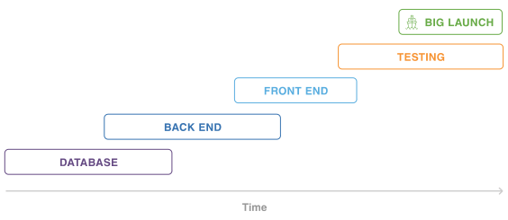
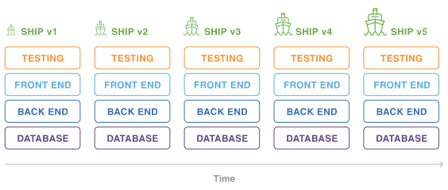

# 实施敏捷工程

一些人认为团队向敏捷转变意味着丢掉大局观, 我对此表示完全无法同意.

早期敏捷开发的使用者通常都是小型的,独立的团队, 开发的内容也多为小型的,独立的项目. 他们证实了敏捷模型可以成功. 最近, 更多大型企业正在将敏捷扩大到单个团队/项目更广的范围, 并且寻找应用到整个系统的方式.

这确实是很有挑战性的过程, 但这并不意味着大规模的敏捷化无法完成.

## Waterfall versus Agile

首先我们来了解一下是什么让敏捷与传统的开发方式区别开来.

传统的项目管理方式, 类似waterfall, 分阶段进行建设, 如下图所示:

这种产品开发方式将所有东西并入一个较大的,高风险的release中, 一旦这个项目通过一个阶段, 重回前面数个阶段是个非常令人痛苦的的事情, 因为团队总是向前推进.

传统的项目管理方式总是会创造一些''关键路径''(critical paths), 直到阻塞的issue被解决之前整个项目无法继续向前推进. 更为严重的问题在于项目完成之前, 用户无法体验到最新的产品功能. 因此, 许多在产品设计中,代码中暗藏的issue直到上线(release)之前一直都不会被发现.

接着我们对比下敏捷化的项目管理方式, 通常采用迭代的方式进行开发, 并且能够获得阶段性的反馈. 这些迭代允许团队转移到项目的另一个区域继续开发, 同时解决阻塞问题.

除了不再有"关键路径"之外, 迭代还允许在开发期间与产品进行交互.

这为团队持续提供了build,交付,学习和调整的机会. 变化不会让你措手不及, 团队随时准备快速适应新的要求.

此外还有额外的好处: 团队可以共享技能. 团队交叉的技能为团队代码库的所有部分的工作增加了灵活性. 这样，如果项目方向发生变化，工作和时间就不会浪费.

## 如何打造一个优秀的敏捷团队:

当一个工程从传统的项目管理转换为Agile, 团队和利益相关者(stakeholders)必须拥抱以下2个重要的概念和变化:

PM的关注点应该是提高开发团队产出的价值. 开发团队依赖于PM调整工作的优先级.
开发团队当且仅当处理的能力有余量时才可接受新的任务. PM不应当将工作直接推给团队, 亦或随意给出截止时间. 当开发团队有能力接受新的工作时, 才从工程的backlog 中取出最优先的需求.

接着让我们探究敏捷工程所用迭代化的组织,运行和框架机制.

## 路线图(Roadmaps)

路线图概述了随着时间推移, 一个产品或者解决方案是如何被开发的. 路线图由包含大量功能的计划组成, 并包括何时功能可用的时间表. 随着工程的推进, 路线图可以接受或大或小的变化. 目的是使路线图专注于当前的市场条件和长期目标.

## 要求(Requirements)

路线图中的每项举措都分解为一系列要求, 敏捷要求是对所需功能的轻量级描述, 而不是传统项目中的100页文档. 它们随着时间的推移而发展, 并充分利用团队对客户和所需产品的共同理解. 敏捷要求应始终保持精简, 而团队中的每个人都通过持续的对话和协作来形成共识.  只有在实施即将开始时, 这些需求的细节才会被充实.

## Backlog

Backlog设置了敏捷项目的优先级, 团队将所有的工作事项塞入backlog中: 新的需求特性, bug, 改进, 重构, 技术或架构相关的任务等. PM为开发团队的backlog调整优先级, 开发团队使用已调整优先级的backlog作为其需要完成的工作的唯一来源.

## Agile delivery vehicles

敏捷可以使用不同的框架来完成, 比如scrum和kanban. Scrum团队使用sprints指导开发, kanban团队则没用固定的工作阶段. 2个框架都使用delivery vehicles(例如epics和版本)将开发结构化, 以同步发布的节奏.

## 敏捷指标

敏捷团队通过指标成长.  Working in Progress（WIP）的限制使团队和业务部门专注于交付最优先的任务。 burndown chart和control charts 等图形可帮助团队预测其交付节奏, 连续流程图(continuous flow diagrams)有助于识别瓶颈.  这些指标和工件使每个人都专注于大目标, 并增强团队未来工作能力的信心.

## 敏捷依靠信任运行

如果没有团队成员之间的高度信任, 敏捷计划就无法运作. 对于程序和产品的正确性, 需要坦率地进行对话. 由于对话定期发生, 想法和顾虑会定期被表达出来.  这意味着团队成员还必须对彼此在这些对话期间做出的决策的执行能力（和意愿）充满信心.

总之, 敏捷开发是一种结构化和迭代的软件开发方法. 它使我们能够在不脱轨的情况下响应变化. 这对任何工程来说都是好消息.